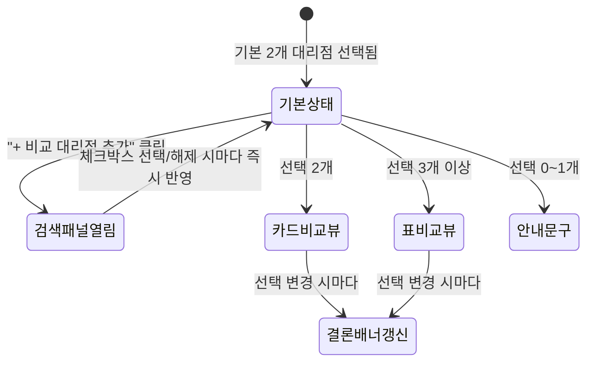
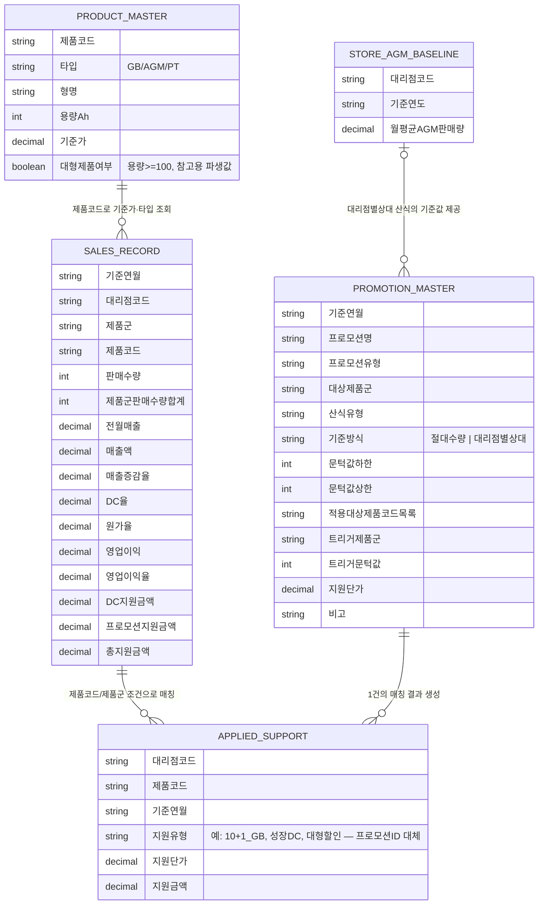

# PRD — 프로모션 효과 시뮬레이션 에이전트

- **근거 문서**: `02_프로모션효과분석_기획서.md`(루트), `.docs/01_sample_orders_schema.md`(v11, 프로젝트 루트)
- **범위 확정 근거**: 사용자 사전 확인(타겟 사용자/MVP 범위/기술 제약/완료 기준) — `01_PRD_작성_계획서.md` 참고
- **실제 제품·프로모션 자료 반영**: `03_제품마스터_및_DC정책.md`(제품 61종, DC 정책), `04_프로모션이력.md`(1월·3월·8월 프로모션 실제 사례) — 사용자가 제공한 실물 자료를 근거로 아래 정의를 보정함
- **용어 정의(사용자 확인, 중요)**: 이 문서와 화면에서 말하는 "영업이익/영업이익율"은 **대리점 자체의 손익이 아니라, 해당 대리점의 판매실적(제품·수량·DC·지원금액)을 기준으로 산정되는 본사(세방전지) 기준 영업이익(율)**이다. 즉 "이 대리점이 이런 실적을 냈을 때 본사가 얻는 이익률"을 뜻하며, 대리점의 경영 성과 지표가 아니다. 이 구분은 6.6·6.7절의 대리점 그룹별 조회 기능에서 특히 중요하다 — "영업이익율 -10% 이하 그룹"은 그 대리점이 적자라는 뜻이 아니라, 그 대리점에 대한 DC·프로모션 지원이 본사 마진을 얼마나 깎아먹었는지를 나타낸다.

## 1. 문제 정의

국내영업본부 차량대리점팀은 GB/AGM/대형제품 등 제품군별로 서로 다른 조건(구간별 대당 지원단가, 특정 제품코드별 고정 지원단가, 다른 제품군의 목표 달성에 연동된 지원, 또는 10+1 무상증정)의 프로모션을 연 약 8회 시행한다. **한 달에 프로모션이 하나만 시행되는 것은 아니며, 서로 다른 제품군·조건을 대상으로 한 프로모션이 같은 기간에 동시에 여러 건 진행되는 경우가 많다.** 예를 들어 2026년 8월에는 (1) AGM 레벨 구간별 인센티브 D/C이면서 AGM 목표 수량 달성 시 지정된 GB 품목까지 추가 할인되는 "AGM Level up 프로모션"과, (2) 특정 대형제품 품목마다 수량과 무관하게 대당 고정 금액을 지원하는 "대형 제품 D/C 프로모션"이 같은 기간 동안 동시에 시행되었다. 프로모션 종료 후 담당자는 대리점별 실적을 엑셀로 수기 취합해 매출·지표를 재계산하고 피벗테이블로 집계한 뒤 손익 보고서를 작성하는데, 이 전 과정이 자동화 로직 없이 담당자 1인의 수작업에 의존한다.

이 과정에서 담당자가 실제로 겪는 고통은 다음 두 가지로 요약된다.

1. **원인을 분리해서 설명할 수 없다.** 동일 프로모션(들)을 시행해도 대리점별 영업이익율이 다르게 나오는데, 그 차이가 (a) 대리점 등급별로 고정 적용되는 DC율 때문인지, (b) 제품군별로 다른 지원단가·문턱값 때문인지, (c) 같은 제품군 내 여러 제품을 나눠 판 결과 판매수량 합계가 문턱값을 넘거나 못 넘었기 때문인지, (d) 같은 달에 동시 시행된 여러 프로모션 중 일부에만 해당되어(예: 대형제품 D/C 대상 품목이 아니어서) 지원을 받지 못했기 때문인지 손으로는 구분해내기 어렵다. 특히 (c)는 개별 제품이 아니라 "같은 대리점·같은 제품군 판매수량 합계"로 판정해야 하므로, 제품이 여러 행으로 나뉘어 팔린 경우 합산을 누락하면 지원 대상 여부 자체를 잘못 판단하게 된다. (d)는 한 제품(행)이 동시에 진행 중인 여러 프로모션 조건에 동시 해당할 수 있고, 그중 하나는 자신이 속한 제품군이 아니라 다른 제품군(예: AGM)의 판매실적에 연동되어 있을 수 있어, 프로모션별 지원금액을 모두 찾아 합산하지 않으면 총 지원금액을 과소 산정하게 된다.
2. **매년 반복되는 수작업이 시간과 오류 위험을 모두 만든다.** 취합(1~2시간)·집계(2시간)·보고서 작성(1시간)에 매번 4~5시간이 들고, 대리점별 DC율이 반영된 실매출을 손으로 재계산하다 보니 계산식 오류가 발생하기 쉽다. 게다가 신규 프로모션 방식이 도입될 때마다 집계 양식과 계산식을 처음부터 다시 설계해야 해(추정 1일 이상) 기존 프로모션과의 비교도 어렵다.

왜 이런 일이 벌어지는가: 프로모션 조건(대상 제품군·문턱값 구간·지원단가)이 담당자 개인의 엑셀 수식 안에 고정되어 있고, 이를 코드나 별도 자료로 분리해 관리하지 않기 때문이다. 조건이 바뀌거나 새 프로모션 유형이 생길 때마다 수식을 처음부터 다시 짜야 하는 구조가 반복 비용과 오류 위험의 근본 원인이다.

## 2. 타겟 사용자 + 페르소나

**주 사용자**: 실무 담당자(엑셀 업로드·분석 실행) + 팀장(결과를 보고 차기 프로모션을 의사결정) — 2인 구도.

### 페르소나 1 — 김도윤, 차량대리점팀 실무 담당자
- 매월 마감 후 대리점별 실적 엑셀을 취합해 손익 보고서를 작성하는 업무를 담당한다.
- 엑셀 수식과 피벗테이블에는 익숙하지만, "같은 제품군 판매수량을 합쳐서 문턱값을 넘었는지" 같은 조건은 매번 대리점·제품 단위로 손으로 대조해야 해 실수가 잦다.
- 이번 프로모션이 끝나면 팀장에게 "왜 A 대리점은 영업이익율이 높고 B 대리점은 낮은지" 설명할 자료를 30분 안에 만들어야 한다.
- 원하는 것: 실적 엑셀과 프로모션 기준 엑셀 두 개만 올리면, 대리점·제품 단위로 지원 대상 여부·지원금액·영업이익율이 자동으로 나오고, 그 차이가 DC율 때문인지 지원 조건 때문인지 화면에서 바로 구분되는 것.

### 페르소나 2 — 박서연, 차량대리점팀 팀장
- 김도윤이 만든 보고서를 보고 다음 프로모션의 제품군·문턱값·지원단가를 어떻게 설계할지 결정한다.
- 영업이익율만 보고 프로모션의 성패를 판단하면, 손익보다 매출 확대가 목적이었던 프로모션을 잘못 "실패"로 규정할 위험이 있다는 것을 알고 있어, 매출증감율도 함께 보고 싶어 한다.
- 세부 계산식보다는 "이번 프로모션이 목적(손익 개선 또는 매출 확대)에 맞게 작동했는가"라는 결론에 관심이 있다.
- 원하는 것: 대리점·제품군별 영업이익율과 매출증감율을 한 화면에서 나란히 보고, 편차의 구조적 원인(DC율 차이 vs 지원 조건 차이)을 근거로 다음 프로모션 설계 방향에 대한 판단 재료를 얻는 것.

## 3. 목표와 비목표

### 목표 (Goals)
- 대리점×제품 단위로 DC율 반영 매출액, 제품군 합산 기준 프로모션 해당 여부, 지원단가, 지원금액, 영업이익율을 자동 산출한다.
- 영업이익율과 매출증감율을 어느 한쪽도 우선시하지 않는 병렬 지표로 제시해, 손익 관점과 매출 관점을 모두 확인할 수 있게 한다.
- 프로모션 조건(유형·대상제품군·문턱값 구간·지원단가 또는 무상증정비율)을 코드에 고정하지 않고 "프로모션 기준 마스터" 업로드 파일로 분리해, 신규 프로모션 유형도 코드 수정 없이 분석 가능하게 한다.
- 월 4~5시간 걸리던 집계·보고 작업을 30분 이내로 단축한다.
- **(신규, 사용자 확인)** 기준연월별 분석 결과(대리점×제품 실적, 매칭된 프로모션, 지원금액, 영업이익율·매출증감율)를 DBMS에 누적 저장해, 이후 시점에 과거 기준연월을 선택하면 그 시점의 프로모션 효과를 다시 조회할 수 있게 한다. 예: 2027년 2월 시점에 2026년 10월에 시행했던 프로모션의 효과를 재조회.

### 비목표 (Non-goals)
- 매출액·DC율·원가율·영업이익율의 산출 기준 자체를 검증하거나 재계산하지 않는다 (영업기획팀 제공 확정 데이터를 그대로 신뢰).
- 프로모션 시행 일정(시작일/종료일) 관리를 제공하지 않는다 (기준연월 단위 분석만 지원).
- 사용자 인증/권한 관리, 다중 사용자 동시 편집을 제공하지 않는다.
- **(수정, 사용자 확인)** 과거에는 "세션 간 데이터 영속 저장을 제공하지 않는다(stateless 웹앱 전제)"를 비목표로 뒀으나, 팀장이 이후 시점(예: 2027년 2월)에 과거 프로모션(예: 2026년 10월 시행분)의 효과를 다시 조회해야 한다는 요구가 확인되어 이 비목표는 폐기한다. 기준연월별 분석 결과를 DBMS에 누적 저장해 과거 시점 조회를 지원하는 것은 이제 목표(3절 목표, 6.8절)로 전환한다.
- **(수정, 사용자 확인 — 과제 등록 정보 기준 재정렬)** MVP는 "엑셀 업로드 → DC율 반영 매출·제품군 합산 판정·지원금액 자동계산 → 영업이익율·매출증감율 표시"까지의 단일 실행 흐름에 집중한다. **편차 원인 구분 표시(6.5)·프로모션 효과성 평가(6.6)·대리점 그룹별 조회(6.7)·기준연월 이력 조회 UI(6.8)와, 프로모션 간·유형 간 비교(캠페인 여러 개를 나란히 놓고 순위·평균을 비교하는 기능)는 모두 MVP가 아니라 "최종 결과물" 단계로 통합해 이연한다.** 이전 버전은 이 중 편차 원인 구분·효과성 평가·그룹별 조회를 MVP로 분류했었으나, 사용자가 제공한 과제 등록 정보의 MVP 정의("엑셀 업로드·실적 표시, 볼륨프로모션 지원금 자동계산까지")가 이보다 좁아 그 기준에 맞춰 재정렬했다(`08_기술스택.md` 4절 — 조정 내역 참고).
- 차기 프로모션 설계안을 시스템이 자동 생성하지 않는다 — 시스템은 판단 근거(데이터)를 제공하고, 설계 의사결정은 팀장이 한다.

## 4. 사용자 스토리

**(수정, 사용자 확인)** 과제 등록 정보의 MVP/최종 결과물 정의에 맞춰 아래처럼 두 단계로 재정렬했다(기존 "v2"·"이후 단계" 구분은 "최종 결과물" 하나로 통합). 조정 내역은 `08_기술스택.md` 4절 참고.

**MVP**
- 실무 담당자로서, 실적 엑셀과 프로모션 기준 마스터 엑셀 두 개를 업로드하고 싶다. 그래야 손으로 조건을 대조하지 않고도 지원 대상 여부를 바로 확인할 수 있다.
- 실무 담당자로서, 같은 대리점·같은 제품군의 판매수량이 자동으로 합산되어 문턱값 충족 여부가 표시되기를 원한다. 그래야 제품이 여러 행으로 나뉘어 팔린 경우에도 합산 누락 없이 지원 대상을 판정할 수 있다.
- 실무 담당자로서, 대리점별 DC율이 반영된 매출액과 지원금액이 분리되어 표시되기를 원한다. 그래야 영업이익 변동의 원인이 할인 때문인지 지원금 때문인지 구분해 설명할 수 있다.
- 팀장으로서, 대리점별 영업이익율과 매출증감율을 한 화면에서 나란히 보고 싶다. 그래야 손익 개선과 매출 확대 중 어느 목적에 더 부합했는지 어느 한쪽에 치우치지 않고 판단할 수 있다.
- ~~실무 담당자로서, 프로모션 기준 마스터에 없는 프로모션ID가 실적 자료에 있으면 경고를 보고 싶다.~~ → **삭제(사용자 확인)**: 프로모션ID는 실제로 존재하지 않는 개념이라 이 스토리 자체가 성립하지 않는다. 10절 참고.

**최종 결과물** *(기존 v2 + 이후 단계를 통합, 과제 등록 정보의 "교차분석·프로모션 간 효율비교·차기 설계 제안·다운로드"에 대응)*
- 팀장으로서, 특정 대리점의 영업이익율이 낮은 이유가 DC율 때문인지 제품군 지원 조건 때문인지 화면에서 바로 구분해서 보고 싶다(교차분석). 그래야 편차의 원인을 정확히 짚어 다음 프로모션 설계에 반영할 수 있다.
- 팀장으로서, 이번 프로모션이 해당/미해당 대리점 그룹 간 영업이익율·매출증감율 격차와 지원금액 대비 ROI로 봤을 때 본사 입장에서 효과적이었는지 판단하고 싶다(교차분석).
- 팀장으로서, 전사 평균뿐 아니라 우수/보통/저조 그룹별로 프로모션 효과를 나눠 보고 싶다(교차분석).
- 팀장으로서, 과거에 시행했던 프로모션의 효과를 이후 시점에 다시 조회하고 싶다(예: 2027년 2월에 2026년 10월 프로모션 효과 재조회). 그래야 매번 파일을 새로 준비하지 않고도 과거 성과를 근거로 다음 프로모션을 설계할 수 있다.
- 팀장으로서, 여러 프로모션(예: 8월 GB 볼륨프로모션 vs 9월 신규 프로모션)의 평균 영업이익율·매출증감율을 나란히 비교하고 싶다(프로모션 간 효율비교). 그래야 연간 프로모션 중 손익 효율이 높은 설계와 매출 기여가 높은 설계를 각각 식별할 수 있다.
- 팀장으로서, 프로모션 유형별(10+1 vs 제품군 볼륨프로모션 vs 신규 유형) 평균 지표를 비교하고 싶다(프로모션 간 효율비교). 그래야 어떤 지원 방식이 더 효율적인지 유형 단위로 판단할 수 있다.
- 팀장으로서, 과거 프로모션 데이터를 근거로 차기 프로모션의 제품군·문턱값·지원단가 설계안을 손익 최적화안·매출 최적화안으로 구분해 추천받고 싶다(차기 설계 제안).
- ~~실무 담당자로서, 대리점등급별 가중치를 적용한 전사 가중평균 영업이익율을 보고 싶다.~~ → **삭제(사용자 확인)**: 대리점등급 자체가 존재하지 않는 개념이라 이 스토리 자체가 성립하지 않는다. 10절 참고.
- 실무 담당자로서, 분석 결과를 파일(예: 엑셀/PDF)로 내려받고 싶다(다운로드). 그래야 팀장 보고 자료를 별도로 재가공하지 않아도 된다.

## 5. 기능 목록

**(수정, 사용자 확인)** 과제 등록 정보의 MVP/최종 결과물 정의를 기준으로 재정렬했다. 기존에는 편차 원인 구분·효과성 평가·그룹별 조회·이력 조회까지 MVP에 포함하고 "v2"·"이후 단계"를 그 뒤에 별도로 뒀으나, 과제 등록 정보는 두 단계(MVP/최종 결과물)만 구분하고 있어 이에 맞춰 "v2"·"이후 단계" 구분을 "최종 결과물" 하나로 합쳤다. 조정 배경과 대조표는 `08_기술스택.md` 4절 참고.

### MVP — "엑셀 업로드·실적 표시, 볼륨프로모션 지원금 자동계산까지"
| 기능 | 설명 |
|---|---|
| 실적 파일 업로드 | 대리점×제품 단위 실적 엑셀(`sample_orders` 스키마) 업로드 |
| 프로모션 기준 마스터 업로드 | 프로모션유형·대상제품군·산식유형(구간별단가/무상증정/품목별고정단가/연동형)·문턱값 구간·적용대상제품코드·트리거 조건·지원단가 정의 엑셀 업로드. 같은 기준연월에 여러 프로모션이 동시에 유효할 수 있음 |
| DC율 반영 매출 확인 | 대리점별 DC율과 매출액을 분리 표시 |
| 제품군 합산 판정 | 대리점×제품군×기준연월 단위로 판매수량 합계를 계산하고, 프로모션 기준 마스터의 문턱값과 대조해 해당 여부 판정 |
| 지원단가·지원금액 산출 | 산식유형별로 지원단가·지원금액을 계산하며, 한 제품이 여러 프로모션에 동시 매칭되면 모두 합산. DC 지원금액과 프로모션 지원금액을 분리 산출하고 총 지원금액을 별도 표기 |
| 영업이익율·매출증감율 병렬 표시 | 대리점×제품 단위 결과를 두 지표 어느 쪽도 우선시하지 않고 나란히 표시 |
| ~~기준 미등록 경고~~ | **삭제(사용자 확인)** — 프로모션ID 개념이 없어 더 이상 적용되지 않는다(10절 참고) |
| 프로모션 장단점 분석 **(신규, 사용자 확인)** | 산식유형(품목별고정단가/구간별단가-절대수량/연동형/무상증정)별 구조적 장단점과, 이번 달 실제 데이터가 보여주는 신호(예: 문턱값 근접 대리점 수, 지원금액 집중도)를 함께 정리해 화면 맨 마지막에 보여준다. 차기 설계안을 시스템이 대신 결정하지 않는다는 3절 비목표에 맞춰, 판단을 돕는 참고 의견으로만 제공한다 |
| 분석 결과 DB 저장 | 분석 실행 시 계산 결과(SALES_RECORD·APPLIED_SUPPORT)를 기준연월 키로 DuckDB에 저장(같은 기준연월 재분석 시 덮어쓰기). 과거 연월을 화면에서 다시 불러와 보여주는 조회 UI는 아래 "최종 결과물"에서 제공 |

### 최종 결과물 — "교차분석, 프로모션 간 효율비교, 차기 설계 제안, 다운로드, 사내 배포까지 완성"
| 기능 | 설명 |
|---|---|
| 편차 원인 구분 표시 | 대리점을 다중 선택(최대 5개)해 DC율 차이/지원 조건 차이 관점으로 나눠 보는 카드·표 비교 뷰 (교차분석) |
| 프로모션 효과성 평가 | 프로모션 해당/미해당 대리점 그룹의 평균 본사영업이익율·매출증감율 격차와 지원금액 대비 ROI(추정)를 산출 (교차분석) |
| 대리점 그룹별 조회 | 본사영업이익율 구간(우수/보통/저조)별로 대리점을 묶어 전사 평균과 그룹 평균을 전환 조회 (교차분석) |
| 기준연월 이력 조회 UI | 화면 상단에서 DuckDB에 저장된 과거 기준연월을 선택하면 그 시점의 분석 결과(프로모션 카드·KPI·결과 표·편차 비교)를 다시 불러와 표시 (교차분석의 시계열 확장) |
| 프로모션 간 비교 | 프로모션유형+시행월 단위로 평균 영업이익율·매출증감율 비교 (프로모션 간 효율비교) — 프로모션ID 삭제에 따라 식별 기준을 프로모션유형으로 변경(10절) |
| 프로모션 유형별 비교 | 프로모션유형 단위로 위 지표 평균/분포 비교, 손익 관점 순위·매출 관점 순위 각각 산정 (프로모션 간 효율비교) |
| ~~대리점등급 가중평균~~ | **삭제(사용자 확인)** — 대리점등급 개념이 없어 더 이상 적용되지 않는다(10절 참고) |
| ~~차기 프로모션 설계안 제안~~ | **범위 제외(사용자 확인)** — 3절 비목표("차기 프로모션 설계안을 시스템이 자동 생성하지 않는다")와 이 행이 서로 다르게 서술돼 있었다. 시스템은 판단 근거(교차분석·효과성 평가·문턱값 근접도 등)만 제공하고, 설계 의사결정은 팀장이 한다는 3절 쪽이 실제 방향과 일치한다 — "손익 최적화안·매출 최적화안 추천" 같은 자동 생성 기능은 만들지 않기로 확정했다(10절 참고) |
| ~~결과 내보내기/보고서 자동 생성~~ | **범위 제외(사용자 확인)** — 별도 요청이 없어 현재 범위에서 뺐다. 필요해지면 우선순위를 다시 매겨 추가한다(10절 참고) |

## 6. 기능별 상세 기능 요구사항

**(수정)** 5절 조정에 맞춰 각 절 제목에 단계 표기(MVP/최종 결과물)를 붙였다. 번호 순서는 기존 문서 참조(6.6·6.7절 등)와의 호환을 위해 그대로 유지한다.

### 6.1 실적 파일 업로드 (MVP)
- 담당자는 `.docs/01_sample_orders_schema.md`에 정의된 컬럼(대리점코드, 제품군, 제품코드, 기준가, DC율, 판매수량, 전월매출, 원가율, 영업이익, 영업이익율 등)을 포함한 엑셀 파일을 업로드할 수 있다. **(수정, 사용자 확인)** 원래 목록에 있던 `프로모션ID`는 실제로 존재하지 않는 개념이라 제외했다(10절 참고).
- 시스템은 업로드 즉시 필수 컬럼 존재 여부를 검사하고, 누락 시 어떤 컬럼이 없는지 구체적으로 안내한다.
- 금액 컬럼(콤마 포함 문자열)과 비율 컬럼(% 포함 문자열)은 업로드 시 순수 숫자로 파싱한다.
- **업로드 방식은 특정 형태를 강제하지 않는다(사용자 확인)**: 실적 파일과 프로모션 기준 마스터를 각각 별도 파일로 개별 업로드하거나, 하나의 엑셀 안에 시트를 분리해 올리는 방식 모두 지원한다. 시스템은 파일 개수·시트 구성과 무관하게 필요한 컬럼 집합만 식별해 파싱한다.

### 6.2 프로모션 기준 마스터 업로드 (MVP)
- 담당자는 프로모션명·프로모션유형·대상제품군·산식유형·기준방식·문턱값하한·문턱값상한·지원단가·적용대상제품코드목록·트리거제품군·트리거문턱값 컬럼을 포함한 엑셀 파일을 업로드할 수 있다(`기준방식` 이하 컬럼은 산식유형에 따라 선택적으로 채워진다. 6.3절 참고). **(수정, 사용자 확인)** 원래 있던 `프로모션ID`는 실제로 존재하지 않는 개념이라 제외했다 — 행은 프로모션유형+대상제품군+문턱값하한 조합으로 구분한다(10절 참고).
- 동일 프로모션유형+대상제품군 내 문턱값 구간이 겹치는 경우 업로드 단계에서 오류로 표시한다.
- **하나의 기준연월에 여러 프로모션이 동시에 유효할 수 있다.** 시스템은 프로모션 기준 마스터를 프로모션 단위가 아니라 "동일 기간에 유효한 여러 조건의 집합"으로 취급하며, 특정 프로모션으로 단일화해 조회하지 않는다. (`04_프로모션이력.md`의 8월 사례 — AGM Level up + 대형제품 D/C 동시 시행이 대표적이다.)
- 산식유형이 `구간별단가`이면서 `기준방식`이 `대리점별상대`인 경우(6.3.1절), 문턱값하한·문턱값상한 대신 대리점별 기준값 대비 비율 또는 가산값을 사용하므로 STORE_AGM_BASELINE(7절) 같은 대리점별 기준값 참조 테이블이 별도로 필요하다.

### 6.3 프로모션 매칭 및 지원금액 산출 (MVP — "볼륨프로모션 지원금 자동계산")

#### 6.3.1 산식유형 (4종) 및 구간별단가의 기준방식 (2종)
| 산식유형 | 판정 기준 | 지원금액 계산 |
|---|---|---|
| 구간별단가 — 절대수량 | 동일 대리점+기준연월+대상제품군의 판매수량 합계(`제품군판매수량합계`)가 전사 공통의 절대 문턱값 구간에 해당하는지 (예: 3월 프로모션의 AGM 0~499/500~999/1,000~3,999/4,000대 이상 구간) | 해당 구간의 지원단가 × 판매수량 |
| 구간별단가 — 대리점별 상대 | 판매수량 합계가 **그 대리점의 기준연도 월평균 판매량 대비** 비율(%) 또는 가산값(+n대) 구간에 해당하는지 (예: 8월 AGM Level up — 대리점이 '25년 월평균 2,000대 초과 그룹이면 Level1=월평균×70%, 그 미만 소규모 그룹은 Level1=100대처럼 그룹별로 산식이 다름. `04_프로모션이력.md` 표 참고) | 해당 Level의 지원단가 × 판매수량. 같은 프로모션 내에서 대상제품군이 둘 이상(예: AGM 자체 + 연동된 GB)이면 제품군별로 다른 지원단가를 동시에 적용 |
| 무상증정 (10+1) | 대상제품군(주로 `전체`) 판매수량 | 차감수량(판매수량 ÷ 11의 몫, 내림) × 기준가를 **대리점 미수금(외상채권)에서 차감** — 대당 무상 지급이 아님 |
| 품목별고정단가 | 판매한 제품코드가 마스터의 `적용대상제품코드목록`에 포함되는지(수량 문턱값 없음) | 지원단가 × 판매수량 (예: 1월·3월의 GB 품목 대당 3,000원 정액 D/C, 8월 대형제품 D/C) |
| 연동형 | **다른 제품군**(`트리거제품군`)의 동일 대리점+기준연월 판매수량 합계가 `트리거문턱값` 이상인지 — 이 조건이 참일 때만 `적용대상제품코드목록`에 포함된 제품이 지원 대상이 됨 | 지원단가 × 판매수량 (예: 8월 AGM Level up 달성 시 지정 GB 품목에 Level별 대당 1,000~3,000원 추가 D/C) |

> `04_프로모션이력.md`에 정리된 것처럼, "구간별단가 — 대리점별 상대" 방식은 같은 프로모션이라도 대리점마다 실제 문턱값(대수)이 달라진다. 예를 들어 '25년 월평균 AGM 판매량이 150대인 대리점(101~200대 그룹)은 Level1=100대·Level2=160대·Level3=220대가 되고, 월평균 3,000대인 대리점(2,000대 초과 그룹)은 Level1=2,100대·Level2=2,400대·Level3=2,700대가 된다. 시스템은 이 개별 문턱값을 대리점마다 계산해야 한다.

#### 6.3.2 복수 프로모션 동시 매칭
- 한 SALES_RECORD 행(대리점×제품)은 같은 기준연월에 유효한 프로모션 기준 마스터 중 **자신의 제품코드·제품군 조건에 맞는 항목을 모두** 조회한다. 결과는 0건, 1건, 또는 여러 건일 수 있다(예: 대형제품 D/C 대상 품목이면서 동시에 다른 조건에도 해당하는 경우).
- 연동형 조건은 판정 기준이 되는 판매수량이 **그 행이 속한 제품군이 아닌 다른 제품군**에서 나오므로, 판정 시 반드시 트리거제품군의 동월 합계를 별도로 조회해야 한다.
- 매칭된 프로모션이 여러 건이면 각각의 지원금액을 모두 계산해 합산하고, 화면·보고서에는 "어떤 프로모션에서 얼마가 지원되었는지" 내역을 프로모션별로 함께 표시한다(6.4절 참고).
- ~~실적 자료의 프로모션ID가 프로모션 기준 마스터 어디에도 없으면 해당 프로모션 관련 지원단가·지원금액을 0으로 처리하고 "기준 미등록" 경고를 표시한다.~~ → **삭제(사용자 확인)**: 프로모션ID 개념이 없어 더 이상 적용되지 않는다(10절 참고).

#### 6.3.3 지원금액의 이원화: DC 지원금액 vs 프로모션 지원금액
지원으로 인해 대리점이 얻는 금액 효과는 원인이 서로 다른 두 가지를 합산한 것이므로, 시스템은 이를 항상 분리해서 계산·표시한다.
- **DC 지원금액** = 기준가 × 판매수량 × DC율. **(수정, 사용자 확인)** DC율은 대리점등급이 아니라 대리점별로 항상 고정 적용되는 할인율이다(대리점등급 자체가 존재하지 않는 개념 — 10절 참고). 프로모션 시행 여부와 무관하게 발생하는 금액 효과다.
- **프로모션 지원금액** = 6.3.1의 산식유형별 계산식에 따라 매칭된 프로모션(들)의 지원금액 합계. 프로모션 시행 기간에만 발생하는 금액 효과다.
- **총 지원금액** = DC 지원금액 + 프로모션 지원금액. 두 금액과 합계를 모두 화면에 나란히 표시해, "이 대리점이 이만큼 유리한 것이 DC율 때문인지, 프로모션 때문인지, 둘 다인지"를 한눈에 구분할 수 있게 한다.

### 6.4 지표 표시 (MVP — "실적 표시")
- 대리점×제품 단위 표에 DC율, 매출액, DC 지원금액, 프로모션 지원금액(매칭된 프로모션명 포함), 총 지원금액, 영업이익율, 매출증감율을 함께 표시하되 DC 지원금액과 프로모션 지원금액을 시각적으로 구분하고 합계를 별도로 강조한다.
- 한 행에 매칭된 프로모션이 여러 건이면 프로모션별 지원금액 내역을 모두 펼쳐 보여준다(예: "대형제품 D/C +30,000원", "AGM 연동 GB D/C +30,000원").
- 영업이익율과 매출증감율은 정렬·필터 가능한 병렬 컬럼(또는 병렬 차트)으로 제공하며, 어느 하나를 기본 정렬 기준으로 강제하지 않는다.

### 6.5 편차 원인 구분 (최종 결과물 — "교차분석")

#### 6.5.1 기능 요구사항
- 대리점 목록에서 특정 대리점(들)을 선택하면, 선택된 대리점 간 DC율 차이와 지원단가/지원금액 차이를 나란히 비교하는 뷰를 제공한다.
- 동일 프로모션 내에서 제품군판매수량합계(또는 대리점별 상대 문턱값)를 넘겨 "해당"이 된 대리점과 "미해당"인 대리점을 구분해 보여준다.

#### 6.5.2 화면 설계 — 대리점 다중 선택 UI
기존 기획서·PRD에는 "대리점(들)을 선택"한다고만 서술되어 있고 구체적인 UI가 정의되어 있지 않았다(10장 미해결 질문에 있었음). 아래와 같이 화면 설계를 확정한다.

**구성 요소**
1. **선택된 대리점 칩(chip) 목록**: 화면 상단에 현재 비교 중인 대리점을 칩 형태로 나열한다. 각 칩에는 대리점명과 제거(×) 버튼이 있어 즉시 비교 대상에서 뺄 수 있다.
2. **"+ 비교 대리점 추가" 버튼**: 클릭하면 검색 가능한 체크박스 목록(드롭다운 패널)이 열린다. 목록은 대리점명으로 검색·필터링할 수 있고, 체크할 때마다 즉시 칩 목록과 비교 뷰가 갱신된다(별도의 "적용" 버튼 없이 즉시 반영).
3. **비교 뷰는 선택 개수에 따라 레이아웃이 전환된다**:
   - **0~1개 선택**: "비교하려면 대리점을 2개 이상 선택하세요" 안내 문구만 표시.
   - **2개 선택**: 좌우 2열 카드 레이아웃. 각 카드에 DC 구성(매출DC+성장DC), 대리점별 기준값(예: '25년 월평균 판매량)과 이번 달 실적, 프로모션 Level/구간 달성 여부, DC 지원금액/프로모션 지원금액/총 지원금액, 영업이익율·매출증감율을 세로로 나열한다.
   - **3개 이상 선택**: 카드 레이아웃 대신 표 형태(행=지표, 열=선택된 대리점)로 전환해 한 화면에서 여러 대리점을 동시에 대조한다.
4. **결론 요약 배너**: 선택된 대리점들의 DC율·프로모션 해당 여부 차이를 바탕으로, 영업이익율 격차의 원인이 DC율 차이인지 프로모션 조건(절대/상대 문턱값) 차이인지를 요약하는 문장을 자동 생성해 표시한다.
5. 대리점 수 제한: 화면 가독성을 위해 동시 비교는 최대 5개 대리점까지로 제한한다(6개 이상 선택 시 안내 후 추가 선택을 막음).

**상호작용 흐름**

### 6.6 프로모션 효과성 평가 (본사 관점) (최종 결과물 — "교차분석")
프로모션 결과 표(6.4절)는 대리점별 수치를 보여주지만, "이번 달 시행한 프로모션이 본사 입장에서 효과적이었는가"라는 질문에는 직접 답하지 못한다. 이를 정량적으로 판단할 수 있도록 아래 지표를 추가한다.

- **비교 기준**: 프로모션 미시행 시나리오(반사실)를 만들 수 없으므로, 같은 달 안에서 **프로모션에 실제로 해당(매칭)된 대리점 그룹**과 **해당되지 않은 대리점 그룹**을 나눠 두 그룹의 평균을 비교하는 방식을 기본 기준으로 삼는다.
- **지표 ①: 해당/미해당 그룹 간 평균 본사영업이익율 격차** — 해당 그룹 평균 − 미해당 그룹 평균(%p). 양수이고 클수록 프로모션이 본사 마진 방어(또는 개선)에 기여했다고 해석한다.
- **지표 ②: 해당/미해당 그룹 간 평균 매출증감율 격차** — 같은 방식으로, 프로모션이 매출 확대에 기여한 정도를 본다.
- **지표 ③: 프로모션 ROI(추정)** = (해당 그룹과 미해당 그룹의 매출증감율 격차를 해당 그룹 매출액에 적용한 추정 매출증가액) ÷ 이번 달 총 프로모션 지원금액. "지원금액 1원당 매출이 약 얼마나 늘었는가"를 나타내는 단일 숫자로, 화면에는 "2.4x"처럼 배수로 표시한다.
- 이 지표들은 참고용 추정치이며, 그룹 간 비교이므로 다른 요인(대리점 규모·지역 등)이 섞여 있을 수 있다는 한계가 있다. 다만 손으로 계산하기 어려운 값을 자동으로 보여주는 것 자체가 As-Is 대비 개선이므로 **최종 결과물** 범위에 포함한다.

### 6.7 대리점 그룹별 조회 (최종 결과물 — "교차분석")
팀장이 "전체 평균"뿐 아니라 "성과가 저조한 대리점군에서 프로모션이 얼마나 효과적이었는지" 같은 세분화된 판단을 할 수 있도록, 대리점을 본사영업이익율 구간으로 묶어 조회하는 기능을 제공한다.

- 기본 구간(조정 가능한 기본값): **우수(15% 이상) / 보통(0~15%) / 저조(0% 미만)**. 구간 경계값은 초기값일 뿐이며 향후 UI에서 조정할 수 있도록 설계한다.
- 화면 상단에 [전사 평균] [우수] [보통] [저조] 탭(또는 버튼)을 두고, 선택한 그룹에 대해 **대리점 수, 평균 본사영업이익율, 평균 매출증감율, 평균 총 지원금액**을 요약해 보여준다.
- 탭 전환은 즉시 반영되며(별도 조회 버튼 없음), 6.4절의 대리점×제품 결과 표와 동일한 데이터 소스를 사용해 집계한다.
- 이 기능은 6.6절의 효과성 평가와 함께 사용될 때 의미가 커진다 — 예를 들어 "저조 그룹"에서 프로모션 ROI가 낮다면, 그 그룹을 겨냥한 프로모션 설계가 필요하다는 판단 근거가 된다.

### 6.8 기준연월 이력 조회 (DBMS 기반, 신규) (저장: MVP / 조회 UI: 최종 결과물 — "교차분석"의 시계열 확장)

기존 PRD는 "세션 간 데이터 미저장(stateless)"을 전제로, 한 번의 업로드·분석 결과가 화면을 벗어나면 사라지는 구조였다. 그러나 팀장은 현재 기준연월뿐 아니라 **과거에 시행한 프로모션의 효과를 나중에 다시 확인**해야 한다(예: 2027년 2월 시점에 2026년 10월 프로모션 결과를 재조회). 이를 위해 분석 결과를 세션 밖에 영속적으로 저장하는 **DBMS**가 필요하며, 이는 더 이상 비목표가 아니다.

- **저장 시점**: 담당자가 실적 파일·프로모션 기준 마스터를 업로드해 분석을 실행하면, 계산된 결과(대리점×제품 실적, 매칭된 프로모션·지원금액, 영업이익율·매출증감율, 대리점 그룹 통계)가 해당 **기준연월 키**로 DBMS에 저장된다. 같은 기준연월을 다시 업로드·분석하면 기존 저장분을 덮어쓴다(재계산·재제출 지원).
- **조회 시점**: 화면 우측 상단의 "기준연월" 선택 UI에서 과거 기준연월을 고르면, 시스템은 새로 파일을 업로드하지 않고 DBMS에 저장된 해당 연월의 분석 결과를 그대로 불러와 화면(프로모션 카드, KPI, 효과 평가, 대리점 그룹별 조회, 대리점×제품 결과 표, 편차 원인 구분)에 표시한다.
- **화면 UI**: 기존에는 기준연월이 텍스트로만 표시되고 클릭 동작이 없었다(개정 전 `output/분석결과화면.html`, 현재 `output/02_분석결과화면.html`). 이를 클릭 가능한 드롭다운으로 바꾸고, DBMS에 저장된 기준연월 목록을 최신순으로 나열해 선택할 수 있게 한다. 아직 분석 결과가 저장되지 않은 연월은 목록에 노출하지 않거나, 선택 시 "저장된 분석 결과 없음" 안내를 표시한다(8절 엣지 케이스 참고).
- **비목표 유지 사항**: 사용자 인증·권한 관리, 다중 사용자 동시 편집은 여전히 범위 밖이다. DBMS 도입은 "기준연월별 분석 결과의 조회 가능 기간을 늘리는 것"이 목적이며, 감사 로그·버전 관리·롤백 같은 부가 기능은 다루지 않는다.
- **(수정) 단계 구분**: 분석 실행 시 결과를 DuckDB에 기준연월 키로 저장하는 것은 **MVP**다(5절 "분석 결과 DB 저장" 참고) — 이 저장이 없으면 애초에 나중에 조회할 데이터 자체가 없기 때문이다. 반면 화면에서 과거 기준연월을 선택해 그 결과를 다시 불러와 보여주는 **조회 UI(드롭다운)는 최종 결과물** 단계다. 여러 기준연월을 나란히 비교하는 것(예: 2026-08 vs 2026-10 프로모션 비교)은 5절 "프로모션 간 비교" 범위이며 이 또한 최종 결과물 단계다.

## 7. 데이터 모델 스케치

`.docs/01_sample_orders_schema.md`(v11)와 `03_제품마스터_및_DC정책.md`·`04_프로모션이력.md`(실제 제품·프로모션 자료)를 근거로 한 네 엔티티.

**(수정, 사용자 확인) 실제 구현과의 차이 — 이 절의 나머지 서술(ER 다이어그램·엔티티 설명)은 초기 스케치 당시 그대로 남겨두되, 실제 구현은 다음과 같이 다르다(`.docs/17_실데이터_워크북_반영_계획서.md`·`19_최종백데이터_전환_계획서.md` 참고):**
- **그레인**: 아래 SALES_RECORD ER은 대리점×제품 단위로 정의돼 있지만, 실제 DuckDB `sales_record` 테이블(`app/db.py`)은 **대리점 단위** 1행이다. DC·프로모션 지원금액을 대리점×제품 단위로 계산은 하되(제품별 기준가×판매수량×DC율, 산식유형별 지원금액), 저장·화면 표시는 대리점 단위로 합산한 결과만 다룬다 — (대리점, 제품) 단위 원본은 매 분석 때 업로드 워크북에서 즉석으로 계산될 뿐 DB에 영속 저장하지 않는다.
- **PROMOTION_MASTER·STORE_AGM_BASELINE 테이블은 삭제했다.** 두 테이블 모두 "마스터를 미리 등록해두고 실적과 대조"하는 모델을 전제했지만, 실제로는 프로모션 조건(산식유형·문턱값·지원단가)과 대리점별 AGM Lv 문턱값이 매번 업로드되는 워크북의 "프로모션 기준" 시트 안에 함께 들어 있어 별도 마스터 테이블이 필요 없다 — 분석을 실행할 때마다 그 시트를 직접 파싱해서 계산하고, DB에는 계산 **결과**(SALES_RECORD·APPLIED_SUPPORT에 해당하는 `sales_record`·`applied_support`)만 기준연월 키로 저장한다. PRODUCT_MASTER도 마찬가지로 별도 시드 테이블 없이, "프로모션 기준" 시트의 제품코드·제품구분1·기준가 컬럼을 그때그때 읽어 쓴다.
- **"산식유형" 컬럼이 핵심 설계 원칙이 됐다.** 아래 PROMOTION_MASTER 스케치의 `산식유형`은 유지되지만, 문턱값하한/상한 같은 절대값 컬럼 대신 **제품별로 조건 3단·금액 3단**(구간별단가-절대수량)과 **연동형의 트리거제품군·트리거문턱값**을 실측 워크북의 실제 배치(제품코드별 행)에 맞춰 구현했다. 프로모션명은 자유 텍스트로 남기고, 산식유형(무상증정/품목별고정단가/구간별단가-절대수량/연동형) 고정 어휘만으로 계산이 갈리게 해, 프로모션명이 매달 바뀌어도 코드 수정 없이 반영되도록 했다(10절 참고).
- 아래 ER 다이어그램·필드 설명은 이 정정을 반영해 다시 그리지 않고 최초 스케치 그대로 남겨둔다(변경 이력 보존 원칙) — 실제 스키마는 `app/db.py`(저장), `app/workbook_ingest.py`(파싱·계산)를 기준으로 삼는다.

**제품군 개념 정정**: 실제 제품 마스터를 보면 "타입"(GB/AGM/PT)과 "대형제품 여부"(용량≥100, 파생값)는 서로 다른 축이며 겹칠 수 있다(`03_제품마스터_및_DC정책.md` 1절). 따라서 PRODUCT_MASTER를 신설해 타입·용량·기준가를 관리하고, SALES_RECORD·PROMOTION_MASTER의 `제품군` 표기는 "타입"과 "대형제품 여부"를 함께 참고해 해석해야 한다. 다만 지금까지 확인된 프로모션은 "대형제품"을 항상 명시적 제품코드 목록(품목별고정단가)으로 지정했으므로, 용량 기준 자동 판정은 참고용으로만 쓰고 실제 매칭에는 쓰지 않는다.

- **PRODUCT_MASTER**: 신설 엔티티. `03_제품마스터_및_DC정책.md`의 61종 제품을 원본으로 한다. SALES_RECORD는 제품코드로 이 테이블을 조회해 타입·기준가를 얻으며, `제품군판매수량합계` 집계 시에도 "타입" 기준으로 합산한다.
- **STORE_AGM_BASELINE**: 신설 엔티티. 8월 AGM Level up 프로모션처럼 "대리점별상대" 기준방식의 산식유형이 문턱값을 계산할 때 참조하는 대리점별 기준값 테이블이다(현재는 '25년 월평균 AGM 판매량 1종만 확인됨. 향후 다른 프로모션이 다른 기준값을 요구하면 컬럼이 늘어날 수 있다).

- **SALES_RECORD**: 대리점×제품 단위 실적 1행. `대리점코드+제품코드+기준연월`이 사실상의 키 역할을 한다. `제품군판매수량합계`는 계산된 파생값이며, 동일 대리점+기준연월+제품군을 가진 모든 행이 같은 값을 가져야 한다. 프로모션ID를 행 자체의 속성으로 갖지 않는다 — 한 행이 같은 달에 여러 프로모션에 동시 매칭될 수 있기 때문이다(6.3.2절). **(수정, 사용자 확인)** `대리점등급` 필드도 제거했다 — 실제로 존재하지 않는 개념이다(10절 참고).
- **PROMOTION_MASTER**: 프로모션 조건 정의 1행(구간 또는 조건 1개). `프로모션유형+대상제품군+문턱값하한`이 사실상의 키 역할을 한다(원래는 `프로모션ID+대상제품군+문턱값하한`이었으나, 프로모션ID가 실제로 존재하지 않는 개념이라 삭제했다 — 사용자 확인, 10절 참고). 산식유형이 `품목별고정단가`·`연동형`인 행은 `적용대상제품코드목록`을 사용하고, `연동형`은 추가로 `트리거제품군`·`트리거문턱값`을 사용한다(6.3.1절 표 참고). 같은 기준연월에 여러 프로모션이 동시에 유효할 수 있다. **(구현 결정, Day 1)** ER 다이어그램에 `기준연월` 필드를 추가했다 — 업로드된 프로모션 기준 마스터 전체가 어느 기준연월에 적용되는지를 행 단위로 표시해야, 실적 파일과의 기준연월 일치 검사(8절)와 DuckDB 저장(6.8절)이 가능하기 때문이다. `app/schema.py`의 `PROMO_REQUIRED_COLUMNS` 참고.
- **APPLIED_SUPPORT**: SALES_RECORD 한 행이 PROMOTION_MASTER의 여러 조건과 매칭된 결과를 개별 건으로 기록하는 파생 테이블(0~N건). SALES_RECORD의 `프로모션지원금액`은 해당 행에 연결된 APPLIED_SUPPORT 전체의 지원금액 합계다. **(수정, 사용자 확인)** `프로모션ID` 필드는 `지원유형`(예: "10+1_GB", "성장DC", "대형할인")으로 대체했다.
- **(수정, 사용자 확인)** 기존에는 "세 테이블 모두 세션 내 메모리(pandas DataFrame)에만 존재하며, 업로드가 끝나면 세션 종료 시 폐기된다(stateless 전제)"였으나, 6.8절의 기준연월 이력 조회를 지원하기 위해 이 전제를 폐기한다. `기준연월`이 확정된 계산 결과(SALES_RECORD·APPLIED_SUPPORT와 이를 집계한 대리점 그룹 통계)는 분석 실행 시점에 **DBMS에 기준연월 단위로 영속 저장**되고, 세션이 끝나도 유지된다. ~~PRODUCT_MASTER·PROMOTION_MASTER·STORE_AGM_BASELINE(마스터성 데이터)도 마스터 갱신 이력 조회가 필요하므로 함께 DBMS에 저장하는 것을 기본으로 한다.~~ **(수정, 사용자 확인)** 이 세 마스터 테이블은 결국 만들지 않았다 — 마스터성 데이터가 매번 업로드되는 워크북 안에 이미 있어서, DB에는 기준연월별 계산 **결과**(sales_record·applied_support)만 저장한다(7절 정정 참고). **(확정, 사용자 확인)** DBMS는 **DuckDB**로 확정했다(임베디드·서버리스 구조라 "단일 프로세스, 사내망 로컬 실행" 배포 조건에 부합하고 pandas와 직접 연동됨). 세부 저장 방식(정규화된 테이블 vs 기준연월별 스냅샷 테이블)은 구현 단계에서 결정하되, 선정 근거와 계층별 기술 스택 전체는 `08_기술스택.md` 참고.

## 8. 엣지 케이스 및 실패 상태

| 상황 | 처리 방식 |
|---|---|
| 한 대리점의 한 제품 행이 같은 달에 시행 중인 여러 프로모션 조건에 동시 매칭됨 | 각 프로모션의 지원금액을 모두 계산해 합산하고, 어떤 프로모션에서 얼마가 지원됐는지 내역을 프로모션별로 함께 표시 (오류 아님, 정상 처리) |
| 연동형 프로모션의 트리거제품군 판매수량 합계가 문턱값 미만 | 연동 대상 제품코드에도 프로모션 지원금액을 0으로 처리(DC 지원금액은 별도로 정상 계산) |
| ~~프로모션 기준 마스터에 없는 프로모션ID가 실적 자료에 존재~~ | **삭제(사용자 확인)** — 프로모션ID 개념이 없어 더 이상 해당하지 않는다(10절 참고) |
| 프로모션 기준 마스터 내 동일 프로모션유형+대상제품군의 문턱값 구간이 겹침 | 업로드 시점에 오류로 표시하고 분석을 진행하지 않음 |
| 실적 자료에 필수 컬럼(기준가, DC율, 판매수량 등)이 누락됨 | 업로드 즉시 누락된 컬럼명을 구체적으로 안내하고 분석을 진행하지 않음 |
| 금액/비율 컬럼에 숫자로 변환 불가능한 값(콤마·%가 아닌 잘못된 문자)이 포함됨 | 해당 행을 오류 행으로 표시하고, 전체 분석을 막지 않되 오류 행 목록을 별도로 제공 |
| 동일 대리점+기준연월+제품군인데 행마다 제품군판매수량합계 값이 다르게 입력됨(원본 데이터 자체 오류) | 시스템이 재계산한 합계값을 우선 사용하고, 원본 값과 불일치한다는 경고를 표시 |
| 전월매출이 0이거나 없어서 매출증감율을 계산할 수 없음 | 매출증감율을 "N/A"로 표시하고 0 또는 오류값으로 오인되지 않게 별도 처리 |
| 제품군판매수량합계가 프로모션 기준 마스터의 모든 구간 하한보다 낮음(미해당) | 프로모션 해당 여부 "N", 지원단가·지원금액 0으로 정상 처리(오류 아님) |
| 대상제품군이 `전체`인 조건(예: 10+1)과 특정 제품군 조건이 같은 프로모션유형에 동시에 존재 | 제품의 실제 제품군과 정확히 일치하는 조건을 우선 매칭하고, 일치하는 조건이 여럿이면 오류로 표시. (아직 실제 시행 사례는 없음 — 향후 시행 시 우선순위 기준표가 별도 제공될 예정이며, 그때 이 처리 방식을 재검토한다) |
| 업로드한 두 파일의 기준연월이 서로 다른 달을 가리킴 | 경고 표시 후 사용자에게 재확인을 요청(자동 병합하지 않음) |
| 사용자가 기준연월 선택 UI에서 아직 분석 결과가 DBMS에 저장되지 않은 연월을 선택함(신규) | "저장된 분석 결과가 없습니다" 안내를 표시하고, 해당 연월의 실적·프로모션 기준 파일을 업로드해 새로 분석하도록 유도 |
| 이미 분석 결과가 저장된 기준연월에 대해 같은 연월로 재업로드·재분석함(신규) | 기존 저장분을 덮어쓰고, 화면에 "이 기준연월의 기존 분석 결과를 갱신했습니다" 안내를 표시 |

## 9. 성공 지표

기획서 9장의 성공 기준을 그대로 채택한다.

- **정확성 (최우선 지표)**: 담당자가 실적 엑셀과 프로모션 기준 마스터 엑셀을 업로드하면, 대리점×제품 단위로 DC율이 반영된 매출액과 제품군 합산 기준 프로모션 해당 여부·지원금액(DC 지원금액/프로모션 지원금액 분리)·영업이익율이 자동 산출되고 매출증감율과 병렬 비교된다. **어떤 프로모션 기준 마스터를 올리더라도 그에 맞는 정확한 산출값·비교분석값이 나오는 것**이 이 시스템의 핵심 가치다(사용자 확인 — `04_프로모션이력.md` 참고). 특정 프로모션 예시 데이터의 세부 수치를 정확히 재현하는 것 자체는 목표가 아니다.
- **속도**: 월 4~5시간 걸리던 집계·보고 작업을 30분 이내로 마칠 수 있다. **단, 이 수치는 As-Is 추정치이며 확정된 목표치가 아니다.** 검증 과정에서 실제 소요시간이 다르게 측정되면 목표 시간을 조정할 수 있으며, 이 지표는 정확성 지표에 비해 우선순위가 낮다(사용자 확인).
- **확장성**: 신규 프로모션 유형도 프로모션 기준 마스터 갱신만으로, 코드 수정 없이 동일하게 분석된다.
- **이력 조회(신규, 최종 결과물 단계)**: 담당자가 어느 시점에 접속하더라도, DBMS에 저장된 과거 기준연월의 분석 결과를 화면에서 선택해 다시 확인할 수 있다(예: 2027년 2월에 2026년 10월 프로모션 효과 재조회).
- **검증 방법**: 최근 1~2개월 실제 실적 데이터를 웹앱에 업로드해 산출된 지원금액·영업이익율이 기존 수기 집계 결과와 일치하는지 대조하고(정확성 검증이 핵심), 처리에 걸린 실제 소요 시간을 참고 지표로 측정하며, 기존에 없던 가상의 프로모션 기준 마스터를 업로드해 코드 수정 없이 분석 결과가 산출되는지 확인한다.

## 10. 미해결 질문

### 확인 완료 (사용자 답변 반영)
- ~~`10+1 프로모션`의 지원금액을 실제 회계상 어떤 계정으로 처리하는지~~ → **확인 완료**: 무상증정이 아니라 대리점 미수금(외상채권)에서 금액을 차감하는 방식이며, 기준 수량도 10대가 아닌 **11대당 1대분**이다(11대 구매 시 1대분, 22대 구매 시 2대분 차감). 본 PRD 6.3절에 반영함. ※ 프로젝트 루트 `.docs/01_sample_orders_schema.md`(v11)는 여전히 "판매수량÷10, 무상증정" 방식으로 기술되어 있어 스키마 문서 자체의 갱신(v12) 필요 여부는 별도 확인 필요.
- ~~GB/AGM/대형제품 외 추가 제품군이 존재하는지~~ → **확인 완료**: 실제 제품 마스터(`03_제품마스터_및_DC정책.md`) 확인 결과, "제품군"은 GB/AGM/PT 3개 타입과 "대형제품"(용량≥100Ah, 파생값)이라는 서로 다른 두 축으로 구성되어 있었다. PT 타입은 현재 프로모션 대상에는 해당하지 않는다. 본 PRD 7절 데이터 모델(PRODUCT_MASTER 신설)에 반영함.
- ~~프로모션 기준 마스터의 실제 엑셀 양식~~ → **확인 중**: 영업기획팀이 통일된 양식으로 확정할 예정. 확정 전까지는 본 PRD 7절의 제안 스키마(프로모션유형·대상제품군·산식유형·문턱값하한·문턱값상한·적용대상제품코드목록·트리거제품군·트리거문턱값·지원단가)를 잠정 기준으로 유지하고, 확정 양식 수령 시 컬럼 매핑을 재검토한다.
- ~~프로모션ID·대리점등급 개념이 실제로 존재하는지~~ → **확인 완료(삭제)**: 둘 다 실제로 존재하지 않는 개념이다.
  - **프로모션ID**: 프로모션을 식별하는 별도 ID가 없다. 대신 프로모션유형(10+1/매출볼륨DC/성과+판촉DC/성장DC/특화제품/대형 등)+대상제품군+문턱값하한 조합으로 행을 구분한다. 이에 따라 "실적 자료의 프로모션ID가 마스터에 없으면 기준 미등록 경고"(6.1·6.3.2·8절에 있던 규칙)는 성립하지 않아 삭제했다. PROMOTION_MASTER·APPLIED_SUPPORT의 `프로모션ID` 필드도 제거했다(APPLIED_SUPPORT는 `지원유형`으로 대체).
  - **대리점등급**: 별도의 등급 체계가 없다. DC율은 "대리점등급별 고정"이 아니라 "대리점별로 일괄 적용"되는 값이다(제품마다 다르지 않음) — 6.3.3절·SALES_RECORD ER에서 관련 문구를 수정했다. 이 개념에 의존하던 "대리점등급 가중평균" 기능(5절)도 함께 삭제했다.
  - 실제 월 마감 워크북(`sample04.xlsx`류) 기반 인입 로직은 `app/workbook_ingest.py`에 구현되어 있으며, 이 결정을 이미 반영한 상태다. 6절의 "프로모션 기준 마스터 업로드 + 산식 매칭" 서술(6.2·6.3.1·6.3.2)은 애초 평평한 한 장짜리 실적 파일을 상정한 대안 경로이고, 실제 데이터 경로(다중 시트 워크북 인입·배분)와는 세부 절차가 다르다 — 두 경로의 관계를 정리하는 것은 아직 남은 과제다(아래 "남은 미해결 질문" 참고).
- ~~한 달에 프로모션이 항상 1건만 시행되는지~~ → **확인 완료**: 아니다. 서로 다른 제품군·조건을 대상으로 한 프로모션이 같은 기간에 동시에 여러 건 진행될 수 있다(예: 2026년 8월 AGM Level up 프로모션 + 대형 제품 D/C 프로모션 동시 시행). 본 PRD 6.3절에 반영해 SALES_RECORD 행이 여러 프로모션에 동시 매칭될 수 있도록 데이터 모델을 수정함(7절 APPLIED_SUPPORT 참고).
- ~~지원금액을 하나의 값으로만 표시해도 되는지~~ → **확인 완료**: 아니다. 대리점별 고정 할인(DC율)로 인한 "DC 지원금액"과 프로모션 시행으로 인한 "프로모션 지원금액"을 항상 분리해서 계산·표시하고, 합계("총 지원금액")도 별도로 표기해야 한다. 본 PRD 6.3.3절에 반영함. (※ "대리점 등급별"이라는 원래 표현은 이후 대리점등급 개념 자체가 삭제되며 "대리점별"로 정정됨 — 위 참고)
- ~~대상제품군이 `전체`인 조건과 특정 제품군 조건이 동시에 정의될 수 있는지~~ → **확인 완료**: 아직 그런 조합을 시행한 적이 없다(예: GB 11대 구매 시 1대 무상 증정과 대당 5,000원 할인의 동시 시행 없음). 향후 이런 조합을 시행하게 되면 우선순위를 규정한 기준표를 별도로 제공할 예정이며, 그 전까지는 8절의 임시 처리 방식(정확히 일치하는 조건 우선, 복수 일치 시 오류)을 유지한다.
- ~~실적 파일과 프로모션 기준 마스터 파일의 업로드 방식이 실제 업무 습관과 맞는지~~ → **확인 완료**: 특정 방식에 매여 있지 않다. 개별 파일 업로드, 한 엑셀 내 시트 분리 등 어떤 방식이든 요구사항대로 지원하면 된다. 본 PRD 6.1절에 반영함.
- ~~성공 지표의 "30분 이내" 소요시간 목표가 확정치인지~~ → **확인 완료**: 확정 목표가 아니라 As-Is 추정치이며, 검증 과정에서 조정 가능하다. 정확성 지표에 비해 우선순위가 낮다. 본 PRD 9절에 반영함.
- ~~8월 AGM Level up 프로모션의 액식(GB) 추가 D/C가 GB 전 품목에 적용되는지, 지정 품목에만 적용되는지~~ → **확인 완료**: 지정된 품목에만 적용된다. 다만 프로모션 세부 내용은 매번 달라지므로, 8월 예시의 정확한 재현보다 마스터 업로드값을 정확히 반영하는 엔진 설계가 더 중요하다(사용자 확인). `04_프로모션이력.md`에 반영함.
- ~~"LR" 표기, `55066(5)`·`73010(1)` 괄호 표기의 의미~~ → **확인 완료**: "LR"은 L·R 두 코드를 함께 지칭하는 표기다(예: `250LR` = `250L`+`250R`). `55066(5)`는 `55065`+`55066`, `73010(1)`은 `73010`+`73011` 두 코드를 뜻한다. `04_프로모션이력.md`에 반영함.
- ~~8월 대형 제품 D/C 목록의 `200L` 중복 등장~~ → **확인 완료**: 오타이며 `200L`은 4,000원 목록이 맞다. `04_프로모션이력.md`에 반영함.
- ~~3월 프로모션 AGM "4,000대 이상" 구간이 타당한 규모인지~~ → **확인 완료**: 개별 대리점 기준으로 타당하다. 대리점 간 매출액·구매 규모의 편차가 매우 큰 구조이기 때문이다. `04_프로모션이력.md`에 반영함.
- ~~성장 DC 3개 조건 동시 충족 시 처리~~ → **확인 완료**: 합산되지 않고 충족한 조건 중 가장 큰 DC율 하나만 단일 적용된다(예: 5% 매출DC + 3% 성장DC = 총 8%). `03_제품마스터_및_DC정책.md` 3.2절에 반영함.
- ~~매출 DC 구간 판정에 쓰이는 "매출 규모"의 기준 시점~~ → **확인 완료**: **전년도 연매출** 기준이다. `03_제품마스터_및_DC정책.md` 3.1절에 반영함.
- ~~`PT` 타입 제품이 향후 프로모션 대상이 될 가능성이 있는지~~ → **확인 완료**: 가능성은 있으나 낮다. 현재는 대상이 아니지만, PRODUCT_MASTER·PROMOTION_MASTER 설계 시 `PT` 타입도 자연스럽게 다룰 수 있도록 배제하지 않는다. `03_제품마스터_및_DC정책.md` 4절에 반영함.
- ~~과거 프로모션 결과를 나중에 다시 조회할 필요가 있는지, stateless 전제를 유지해도 되는지~~ → **확인 완료**: 유지할 수 없다. 팀장이 이후 시점(예: 2027년 2월)에 과거 시행분(예: 2026년 10월 프로모션)의 효과를 다시 확인해야 하므로, 세션 종료 시 데이터가 사라지는 stateless 전제를 폐기하고 **DBMS로 기준연월별 분석 결과를 누적 저장**하는 것으로 정정한다. 본 PRD 3절 비목표→목표 전환, 6.8절(신설), 7절 데이터 모델에 반영함. 화면(`output/02_분석결과화면.html`)에도 기준연월 선택 드롭다운을 반영함. 이후 화면 흐름을 업로드(`01_실적업로드.html`) → 분석 결과(`02_분석결과화면.html`) → 이력 조회(`03_이력_대시보드.html`) 순으로 재정렬함.
- ~~과제 등록 정보(MVP: "엑셀 업로드·실적 표시, 볼륨프로모션 지원금 자동계산까지" / 최종 결과물: "교차분석, 프로모션 간 효율비교, 차기 설계 제안, 다운로드, 사내 배포까지 완성")와 본 PRD 5절의 MVP/v2/이후단계 구분이 서로 다른 문제~~ → **확인 완료(조정)**: PRD 기준을 과제 등록 정보에 맞춰 재정렬했다. 편차 원인 구분(6.5)·프로모션 효과성 평가(6.6)·대리점 그룹별 조회(6.7)·기준연월 이력 조회 UI(6.8)는 MVP에서 빼서 "최종 결과물"(교차분석)로 옮기고, 기존 "v2"·"이후 단계" 구분은 "최종 결과물" 하나로 통합했다. 단, 기준연월별 분석 결과를 DuckDB에 저장하는 것(쓰기)은 이후 조회 기능의 전제 데이터이므로 MVP에 남겨두고, 저장된 결과를 화면에서 선택해 다시 불러오는 조회 UI만 최종 결과물로 분류했다. 3·4·5·6.5~6.8절, `08_기술스택.md` 4절에 반영함.

### 데이터 보완 완료 (1차)
- ~~전 제품 라인업~~ → **반영 완료**: `sample03.csv`(61종, 타입·용량·기준가) 수령, `03_제품마스터_및_DC정책.md`에 반영.
- ~~대리점 DC율 산정 기준~~ → **1차 반영**: 등급별 고정 DC율이 아니라 매출 규모 구간별 "매출 DC" + 조건부 "성장 DC" 가산 구조임을 확인, `03_제품마스터_및_DC정책.md` 3절에 반영. 단, PRD 6.3.3절의 계산 로직 자체는 변경하지 않는다 — 실적 파일에 이미 계산된 DC율이 포함되어 제공되므로 시스템이 이 정책표로 DC율을 재계산하지는 않는다(2절 비목표 유지).
- ~~올해 시행 프로모션 내용~~ → **1차 반영(3건)**: 1월·3월·8월 프로모션을 `04_프로모션이력.md`에 반영. 추가 시행 건이 더 있으나 조건이 중복되어 아직 미제공 — 후속 자료 수령 시 갱신 필요.

### 데이터 보완 예정 (남은 항목)
- 1월·3월 외 나머지 프로모션 이력 전체(중복 조건이라 제외된 건 포함, 있으면 좋음)
- 담당자가 실제로 업로드할 가공된 실적 파일 예시(정식 컬럼 구성이 반영된 샘플)
- 검증용 자료: 위 실적 파일과 짝이 되는, 담당자가 수기로 완성한 손익 보고서(계산 로직 대조 검증용)

- ~~6절의 "프로모션 기준 마스터 업로드 + 산식 매칭 엔진" 서술 vs 실제 구현의 관계 정리~~ → **확인 완료(수렴)**: 한때는 총괄표·프로모션·대형 시트에 지원금액이 대리점 단위로 이미 계산돼 있어 시스템 역할이 "산식으로 계산"이 아니라 "대리점 단위 금액을 제품 단위로 나누는 것"에 가까웠던 적이 있었다(`.docs/13`~`16`번 문서, 이제는 폐기). 이후 팀 마감 자료가 "DC율"·"프로모션 기준"·"DATA" 3시트 구성으로 확인되면서, "프로모션 기준" 시트에 제품코드별 조건·금액·산식유형이 그대로 들어 있어 6.2·6.3.1·6.3.2절이 원래 의도했던 "산식으로 직접 계산하는 엔진"으로 되돌아갈 수 있었다 — 지금 구현(`app/workbook_ingest.py`)은 이 방식이며, 평평한 실적 파일+프로모션 기준 마스터를 각각 올리는 2-파일 업로드 경로(`app/schema.py`·`validation.py`·`parsing.py`)는 실제로 쓰이지 않아 삭제했다(7절·10절 "SALES_RECORD 그레인" 항목 참고). "실제 워크북 인입"과 "산식 매칭 엔진"을 별도 경로로 유지할지 고민할 필요가 없어졌다 — 하나로 합쳐졌다.
- ~~SALES_RECORD 그레인(대리점×제품 vs 대리점)·PROMOTION_MASTER·STORE_AGM_BASELINE 테이블 존치 여부~~ → **확인 완료**: 실제 DuckDB에는 **대리점 단위** `sales_record`만 저장한다(7절 정정 참고). DC·프로모션 지원금액은 (대리점,제품) 단위로 계산은 하지만 저장은 대리점 단위로 합산해서만 한다 — 대리점×제품 단위 원본을 다시 조회할 필요가 아직 없었기 때문이다(필요해지면 그때 별도 테이블을 추가한다). PROMOTION_MASTER·STORE_AGM_BASELINE은 삭제했다 — 프로모션 조건과 대리점별 AGM Lv 문턱값이 매번 업로드되는 워크북 안에 이미 있어서, 미리 등록해두고 대조하는 마스터 테이블이 필요 없었다.
- ~~PRD 3절(자동 생성 안 함)과 5절(차기 프로모션 설계안 "추천") 서술이 서로 다른 문제~~ → **확인 완료(3절 쪽으로 정정)**: 시스템은 판단 근거(교차분석·문턱값 근접도 등)만 제공하고, 설계 의사결정은 팀장이 한다는 3절이 실제 방향과 맞다. 5절의 "차기 프로모션 설계안 제안"·"결과 내보내기/보고서 자동 생성" 두 행은 범위에서 뺐다(5절 참고).

### 남은 미해결 질문
- 페인포인트 표의 소요 시간(취합 1~2시간 등)은 As-Is 추정치이며, 성공 지표의 "30분 이내" 목표 자체도 확정치가 아니므로(9절 참고) 우선순위가 낮은 채로 남겨둔다.
