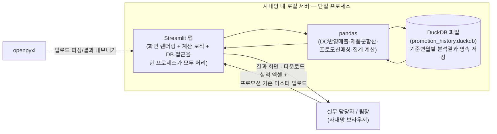

# 기술 스택 문서 — 프로모션 효과 시뮬레이션 에이전트

- **근거**: 사용자가 제공한 과제 등록 정보(아래 표 그대로 인용), `02_PRD.md`(기능 요구사항·데이터 모델), `05_DBMS_도입_및_연월탐색_계획서.md`(DBMS 도입 배경)
- **확정 사항**: Next.js 등 서버/클라이언트 분리형 프레임워크 대신 **Streamlit 기반으로 진행**하기로 확정함(사용자 확인). 이는 과제 등록 정보의 "단일 프로세스(서버/클라이언트 미분리)" 배포 조건과도 부합한다.

## 0. 과제 등록 정보 (원본)

| 이름 | 과제명 | 과제내용 | 배포 환경 | 라이브러리 | DBMS | MVP | 최종 결과물 |
|---|---|---|---|---|---|---|---|
| 강준영 | 프로모션 효과 시뮬레이션 에이전트 | 월별 마감 실적 엑셀 업로드로 대리점·제품별 프로모션 지원금액을 자동 산출하고 영업이익율 편차를 교차 분석하는 웹앱 | 단일 프로세스(서버/클라이언트 미분리), 사내망 내 로컬 실행 · Streamlit | pandas, openpyxl | DuckDB | 엑셀 업로드·실적 표시, 볼륨프로모션 지원금 자동계산까지 MVP | 교차분석, 프로모션 간 효율비교, 차기 설계 제안, 다운로드, 사내 배포까지 완성 |

이 문서는 위 표의 각 항목을 `02_PRD.md`의 요구사항과 연결해 "왜 이 기술을 쓰는지·PRD의 어떤 절을 충족하는지"를 명시한다.

## 1. 배포 아키텍처

과제 등록 정보의 "단일 프로세스(서버/클라이언트 미분리), 사내망 내 로컬 실행"은 곧 **Streamlit 앱 프로세스 하나가 화면 렌더링과 계산 로직을 모두 담당**하고, 별도의 API 서버·프론트엔드 빌드가 없다는 뜻이다. DuckDB도 서버 프로세스가 없는 임베디드(in-process) DB이므로 이 조건과 그대로 맞아떨어진다.

## 2. 계층별 기술 스택 매핑

| 계층 | 기술 | 역할 | PRD 근거 |
|---|---|---|---|
| 실행/배포 | **Streamlit** | 단일 프로세스 웹앱 실행(화면+로직 결합), 사내망 로컬 서버에서 `streamlit run`으로 상시 구동 | PRD 전제(현재 CLAUDE.md 프로젝트 개요에 기재된 "Streamlit 기반 경량 앱" 설계와 일치) |
| 파일 입출력 | **openpyxl** | 실적 파일·프로모션 기준 마스터 엑셀 업로드 파싱(개별 파일 또는 시트 분리 모두 지원), 결과 내보내기(엑셀 다운로드) | 6.1 실적 파일 업로드, 6.2 프로모션 기준 마스터 업로드, 5절 "결과 내보내기"(이후 단계 → 최종 결과물의 "다운로드"에 해당) |
| 계산 엔진 | **pandas** | DC 반영 매출액 계산, 대리점×제품군×기준연월 판매수량 합산, 산식유형별(구간별단가/무상증정/품목별고정단가/연동형) 프로모션 매칭·지원금액 산출, 영업이익율·매출증감율 병렬 집계, 대리점 그룹별 집계 | 6.3 프로모션 매칭 및 지원금액 산출, 6.4 지표 표시, 6.6 프로모션 효과성 평가, 6.7 대리점 그룹별 조회 |
| 영속 저장(DBMS) | **DuckDB** | 기준연월 키로 분석 결과(SALES_RECORD·APPLIED_SUPPORT 스냅샷 및 집계)를 파일 기반으로 영속 저장, 과거 기준연월 조회 시 SQL로 조회 | 6.8 기준연월 이력 조회(신규), 7절 데이터 모델의 "DBMS에 기준연월 단위로 영속 저장" 전제 |

## 3. DuckDB를 DBMS로 선택한 이유

`05_DBMS_도입_및_연월탐색_계획서.md`와 `02_PRD.md` 7절은 "세부 저장 방식(정규화된 테이블 vs 기준연월별 스냅샷 테이블)은 구현 단계에서 결정한다"고 열어두었다. 이번 기술 스택 확정으로 DBMS는 **DuckDB**로 확정한다. 이유:

- **서버 프로세스가 없는 임베디드 DB**라서 "단일 프로세스(서버/클라이언트 미분리), 사내망 로컬 실행"이라는 배포 조건에 별도 DB 서버 설치 없이 그대로 들어맞는다 — DuckDB 파일 하나(`promotion_history.duckdb`)만 사내망 로컬 디스크에 두면 된다.
- **pandas DataFrame과의 연동이 직접적**이다(`duckdb.sql("SELECT * FROM df")` 형태로 별도 ORM/드라이버 계층 없이 계산 결과를 그대로 저장·조회할 수 있어, PRD 2절 비목표 "다중 사용자 동시 편집 미제공"에도 부합하는 가벼운 구조를 유지한다).
- **컬럼 지향 OLAP 엔진**이라 "기준연월별 집계"(6.6·6.7·6.8절에서 반복되는 group-by성 집계) 조회에 적합하다.
- PRD 6.8절이 요구하는 두 동작(① 분석 실행 시 기준연월 키로 저장/덮어쓰기, ② 과거 기준연월 선택 시 재계산 없이 조회)을 각각 `INSERT OR REPLACE`류 SQL과 `SELECT ... WHERE 기준연월 = ?` 조회로 단순하게 구현할 수 있다.

## 4. MVP·최종 결과물 범위 — `02_PRD.md` 5절과의 조정 (완료)

애초 `02_PRD.md` 5절은 편차 원인 구분·효과성 평가·대리점 그룹별 조회·기준연월 이력 조회까지를 MVP로 분류하고 "v2"·"이후 단계"를 그 뒤에 별도로 두고 있어, 과제 등록 정보의 2단계 구분(MVP/최종 결과물)과 범위가 어긋났다. **사용자 확인(2차)에 따라 PRD 쪽을 과제 등록 정보 기준에 맞춰 재정렬했다** — `02_PRD.md` 3·4·5·6.5~6.8절에 반영 완료. 최종 대응 관계는 다음과 같다.

| 과제 등록 정보 문구 | `02_PRD.md` 조정 후 대응 위치 |
|---|---|
| "엑셀 업로드·실적 표시, 볼륨프로모션 지원금 자동계산까지 MVP" | **MVP**: 6.1 실적 파일 업로드, 6.2 프로모션 기준 마스터 업로드, 6.3 프로모션 매칭·지원금액 산출, 6.4 지표 표시, 기준 미등록 경고, 분석 결과 DB 저장(쓰기) |
| "교차분석" (최종 결과물) | **최종 결과물**: 6.5 편차 원인 구분 표시, 6.6 프로모션 효과성 평가, 6.7 대리점 그룹별 조회, 6.8 기준연월 이력 조회 UI(읽기) |
| "프로모션 간 효율비교" (최종 결과물) | **최종 결과물**: 프로모션 간 비교, 프로모션 유형별 비교 |
| "차기 설계 제안" (최종 결과물) | **최종 결과물**: 차기 프로모션 설계안 제안 |
| "다운로드" (최종 결과물) | **최종 결과물**: 결과 내보내기/보고서 자동 생성 |
| "사내 배포까지 완성" | 비기능 요구사항 — 본 문서 1절 배포 아키텍처로 구체화 |

**MVP 안에서의 DB 경계선**: "분석 결과를 DuckDB에 기준연월 키로 저장"하는 쓰기 동작은 MVP에 남겼다 — 이 저장이 선행되어야 최종 결과물 단계의 "과거 기준연월 조회 UI"가 조회할 데이터가 존재하기 때문이다. 반대로 저장된 과거 결과를 화면 드롭다운으로 다시 불러오는 조회 UI는 최종 결과물 단계로 옮겼다.

**(수정, 사용자 확인)** "대리점등급 가중평균" 기능은 삭제했다 — 대리점등급 자체가 실제로 존재하지 않는 개념이다(`02_PRD.md` 10절 참고).

## 5. 요약

| 항목 | 확정 값 |
|---|---|
| 프레임워크 | Streamlit (Next.js 등 서버/클라이언트 분리형 대안 검토 후 기각 — 배포 조건과 불일치) |
| 데이터 처리 | pandas |
| 파일 입출력 | openpyxl |
| DBMS | DuckDB (임베디드, 기준연월 키 기반 영속 저장) |
| 배포 | 단일 프로세스, 사내망 로컬 실행 |
